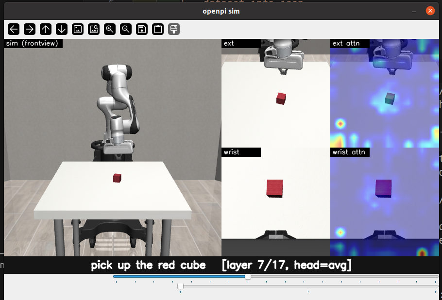

# viz_sim — closed-loop policy sims with live attention

Two parallel sim setups, one per model family. Both render a robosuite Panda
into a single cv2 canvas (sim view + ext/wrist tiles + prompt strip), and
both run the policy as a separate process so the heavy ML deps stay out of
the sim conda env.

| Model           | Transport             | Server launcher           | Sim client                   |
|-----------------|-----------------------|---------------------------|------------------------------|
| pi0 / pi0.5     | websocket, port 8000  | `run_pi0_policy_server.sh`    | `run_pi0_policy_sim.py`          |
| GR00T-N1.7-DROID| ZMQ REQ/REP, port 5555| `run_gr00t_server.sh`     | `run_policy_sim_gr00t.py`    |

> **Always update this README when you change anything in `viz_sim/`.**

## Environments

- **`robocasa_sim` conda env** — sim side for both models. mujoco 3.3.1, numpy 2.x.
- **openpi `.venv`** — pi0.5 server side. Use `bash viz_sim/run_pi0_policy_server.sh`.
- **Isaac-GR00T uv venv** (Python 3.10, CUDA 12.8) — GR00T server side.
  First-time: `cd third_party/Isaac-GR00T && uv sync --all-extras`.

One-time install of sim-side client deps:

```bash
bash viz_sim/install_pi0_client_in_sim_env.sh        # openpi-client (websocket)
bash viz_sim/install_gr00t_client_in_sim_env.sh  # pyzmq + msgpack + scipy + Pillow
```

## pi0 / pi0.5 (openpi)

Default config is `pi05_droid`. Other openpi checkpoints are served by the
same launcher — pass `CONFIG=` and a matching converted-pytorch directory.
Download/convert helpers under `scripts/`:

| Config         | Download script                          | Default `--prompt`                                |
|----------------|------------------------------------------|---------------------------------------------------|
| `pi05_droid`   | `scripts/get_pi05_droid_torch.sh`        | "pick up the cube"                                |
| `pi05_libero`  | `scripts/get_pi05_libero_torch.sh`       | "pick up the alphabet soup and place it in the basket" |
| `pi0_droid`    | `scripts/get_pi0_droid_torch.sh`         | "pick up the cube"                                |

Example (pi05-libero):

```bash
bash scripts/get_pi05_libero_torch.sh                   # one-time
CONFIG=pi05_libero PROMPT="pick up the alphabet soup" \
    bash viz_sim/run_pi0_policy_server.sh
```

Pass `--config` to `run_pi0_policy_sim.py` so the sim-side obs and action
layout match the served checkpoint. Currently supported:

| `--config` | Robot | Controller | Model dims used | Obs builder | Gripper |
|---|---|---|---|---|---|
| `pi05_droid` / `pi0_droid` | Panda (fixed) | `JOINT_POSITION` delta (kp=50, ±0.3 rad) | 8: `[Δjoint(7), grip(1)]` | `make_droid_obs` (`{exterior_image_1_left, wrist_image_left, joint_position, gripper_position}`) | DROID `[0,1]` → binarize at 0.5 |
| `pi05_libero` | Panda (fixed) | `OSC_POSE` delta | 7: `[Δeef_pos(3), Δeef_rot(3), grip(1)]` | `make_libero_obs` (state = `[eef_pos(3), eef_axisangle(3), gripper_qpos(2)]`) | passthrough (`±1`) |
| `pi05_robocasa365` | **PandaOmron** (mobile base) | `OSC_POSE` arm + composite base (HYBRID_MOBILE_BASE) | 12: `[eef_pos(3), eef_rot(3), grip(1), base_motion(4), control_mode(1)]` | `make_robocasa_obs` (state = `[eef_pos_rel(3), eef_rot_rel(4), base_pos(3), base_rot(4), gripper_qpos(2)]`; ext = `robot0_agentview_left` w/ fallback to `agentview`) | passthrough |

**Important**: prior versions of `pi05_droid` / `pi0_droid` used
`JOINT_VELOCITY` — that was incorrect. DROID training defaults to
`action_dict.joint_position` (see `src/openpi/training/droid_rlds_dataset.py:34`),
so the 7 arm dims are *delta joint positions* in radians, not velocities.

For `pi05_robocasa365`: the model was trained on robocasa kitchen tasks
(PandaOmron + 4-DoF mobile base + 12-D composite action), but
`serve_policy_attn.py` is launched with `--config=pi05_droid`, so it slices
to 8 dims and ships DROID-format obs. We use those first 8 dims as
`[Δeef_pos, Δeef_rot, gripper, base_x]` and run on a PandaOmron in robosuite
single-arm tasks. This is **for visualization only** — the obs/action
mismatch means the policy won't behave intelligently, but the robot will
move so you can scrub attention overlays. See
`docs/0428-robocasa-actionspace.md` for the full action-spec analysis.

```bash
# pi05-libero example (server side already running with CONFIG=pi05_libero):
python viz_sim/run_pi0_policy_sim.py --config pi05_libero --prompt "pick up the alphabet soup"
```

### pi0.5-DROID — attention overlay



Single cv2 canvas: sim frontview (left) + `ext`/`wrist` raw tiles and
`ext attn`/`wrist attn` heatmap overlays (right), with the prompt and current
`[layer N/L, head=...]` selection in the bottom strip. The two trackbars below
the strip control layer and head-aggregation mode live.

Server captures **per-layer / per-head text→image attention** in addition to
actions. Reduction (`serve_policy_attn.py`):

- Trim each layer's `(1, H, seq, seq)` to `[TEXT_START_IDX:N_real, :512]`.
- Mean over the *real* text tokens (mask-aware via the policy's input
  transform). Heads are kept separate.
- Stack across all layers → `(L, H, 512)` float32, returned as
  `result["text_to_img_attn"]`. Meta in `text_to_img_meta`.

Sim renders attention live with two cv2 trackbars on the `openpi sim` window:

- **layer** — 0..L-1 (default 7).
- **head: 0=avg 1=min 2=max** — head-aggregation mode.

Selection takes effect on the next rendered frame; no restart needed. The
attention itself only refreshes every `--horizon` (=8) sim steps when a new
action chunk is queried, but you can scrub layers/heads against the most
recent capture in real time. The current selection is shown in the prompt
strip.

```bash
# Terminal 1 — server (openpi venv)
bash viz_sim/run_pi0_policy_server.sh

# Terminal 2 — sim (robocasa_sim conda)
conda activate robocasa_sim
python viz_sim/run_pi0_policy_sim.py --task Lift --prompt "pick up the red cube"
```

Action layout: `[joint_velocity × 7, gripper × 1]` — 8-dim, identical to
the DROID checkpoint output. Robosuite controller is `JOINT_VELOCITY` so
no remap is needed for the qvel dims. Obs is the flat DROID dict
(`observation/exterior_image_1_left`, `observation/wrist_image_left`,
`observation/joint_position`, `observation/gripper_position`, `prompt`).

**Gripper convention — must remap.** pi0/pi0.5-DROID outputs `gripper ∈ [0, 1]`
(0=open, 1=close), matching the DROID dataset (see `examples/droid/main.py`
and `src/openpi/policies/droid_policy.py`). LIBERO and robosuite's `GRIP`
controller expect `[-1, 1]` (-1=open, +1=close). `run_pi0_policy_sim.py`
binarizes at 0.5 and remaps to `±1` before `env.step`; without the remap,
values in `[0, 1]` never command "open" and the gripper stays closed.
Each step prints `[step N] qvel=... grip_raw=... grip_cmd=...` to stdout for
debugging. (For `CONFIG=pi05_libero`, the policy already outputs `[-1, 1]`
and 7-dim actions — the current sim adapter targets DROID and would need a
LIBERO-shaped variant; TODO.)

## GR00T-N1.7-DROID

ZMQ + msgpack to the NVIDIA inference server. We don't install the `gr00t`
package in the sim env; `gr00t_client.py` is a vendored mini-client that
mirrors `gr00t/policy/server_client.py:PolicyClient` (REQ/REP socket,
numpy via `np.save`/`np.load`).

```bash
# Terminal 1 — server (Isaac-GR00T uv venv). Defaults to nvidia/GR00T-N1.7-DROID.
bash viz_sim/run_gr00t_server.sh

# Terminal 2 — sim (robocasa_sim conda)
conda activate robocasa_sim
python viz_sim/run_policy_sim_gr00t.py --task Lift --prompt "pick up the red cube"
```

Notes:

- Robosuite controller is `JOINT_POSITION` with `input_max=output_max=3.14`,
  `input_min=output_min=-3.14` for identity passthrough.
- Images are resized to **180×320** with `resize_with_pad` (vs. 224×224 for
  pi0.5). Obs is nested:
  `{video.{exterior_image_1_left, wrist_image_left}, state.{eef_9d, gripper_position, joint_position}, language.annotation.language.language_instruction}`.
- The script queries `policy.get_modality_config()` at startup and adapts
  `video.delta_indices` (N1.7-DROID actually uses `[0]`, registry default
  was `[-15, 0]`). Frame buffer is sized accordingly.
- Action chunk: `joint_position` (T, 7) is **relative**, applied as
  `target_qpos = current_qpos + Δ` anchored at chunk start. `gripper_position`
  (T, 1) is absolute in [0, 1] and binarized to GRIP `±1`.
- `eef_9d` uses the DROID rotation correction
  (`R @ DROID_EEF_ROTATION_CORRECT`, then top 2 rows = 6D rep). World-frame
  match to DROID is approximate.
- No live attention overlay yet (the GR00T server doesn't expose it); the
  attention plumbing is pi0.5-specific for now.

## Files

- `serve_policy_attn.py` — pi0.5 websocket server that wraps the policy with
  `AttnCapturingPolicy`. Returns `(L, H, 512)` text→img attention per infer.
- `run_pi0_policy_server.sh` — launcher for the above (openpi `.venv`).
- `run_pi0_policy_sim.py` — pi0.5 sim client with live layer/head trackbars.
- `install_pi0_client_in_sim_env.sh` — installs `openpi-client` into `robocasa_sim`.
- `run_gr00t_server.sh` — GR00T server launcher (Isaac-GR00T uv venv).
- `run_policy_sim_gr00t.py` — GR00T sim client.
- `gr00t_client.py` — vendored ZMQ/msgpack `PolicyClient`.
- `install_gr00t_client_in_sim_env.sh` — installs ZMQ/msgpack/scipy/Pillow.
- `setup_robocasa_env.sh` — first-time conda env setup for the sim side.
- `test_viewer.py` — minimal canvas/camera smoke test.
- `eval_runner.py` — headless eval client. Writes `ep_NNN.npz` per episode and
  `_summary.json` per (model, task) under `/mnt/sda/edward/projects/robocasa_365/`.
  At the end of each run it calls `render_example_video.render_for_task(task)` so
  the comparison animation is updated automatically.
- `build_combined_viz.py` — aggregates `ep_NNN.npz` across all (model, task) into
  `results/combined_summary.json`, per-task PNGs (`combined_{task}.png`), and
  `combined.html`. Runs at the end of orchestration scripts.
- `render_example_video.py` — builds 5 animated WebPs, one per task, with 3
  ckpt columns (ext + wrist + attention overlay). Writes `results/video/{task}.webp`.
  Called automatically by `eval_runner.py`; can also be invoked standalone:
  `uv run python viz_sim/render_example_video.py [--task Lift]`.

## Eval data layout & post-eval auto-render

Per-episode rollouts live at `/mnt/sda/edward/projects/robocasa_365/{model}/{task}/ep_NNN.npz`.
Each npz contains `success`, `final_reward`, `steps`, `prompt`, plus subsampled
`attn_stacks` (40, 18, 8, 512), `ext_frames`, `wrist_frames`. After every
`eval_runner.py` invocation the `_summary.json` is written and then
`render_example_video.render_for_task(args.task)` rebuilds
`results/video/{task}.webp` (3 ckpt columns × ext/wrist rows). Missing ckpts
render as a blank panel, so the file is useful even mid-sweep.

## When you edit anything here

Update this README in the same change. Add/rename the file in the table or
file list, and update the runtime notes if obs/action layout, default
ports, controller settings, or the attention payload shape change.
